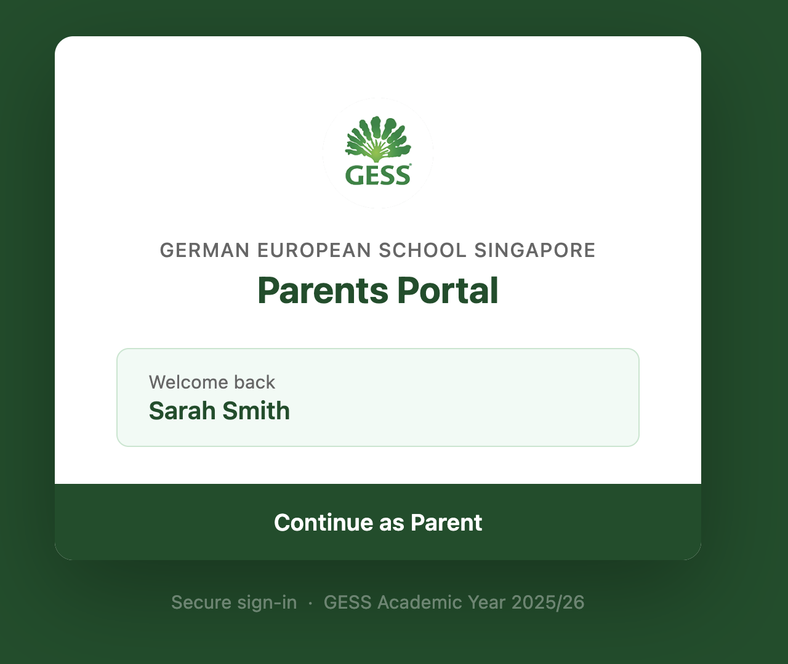
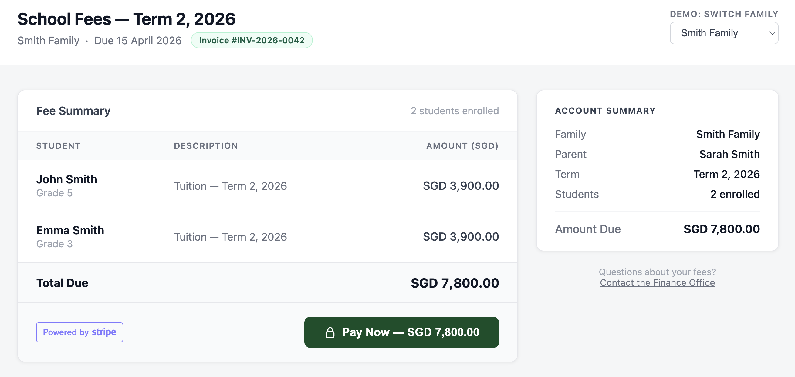
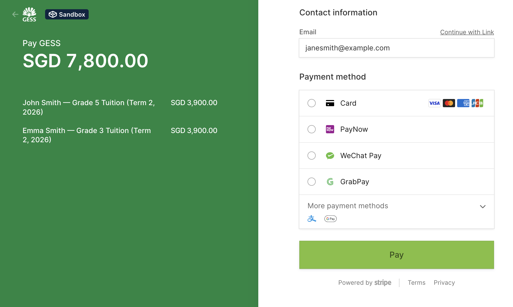
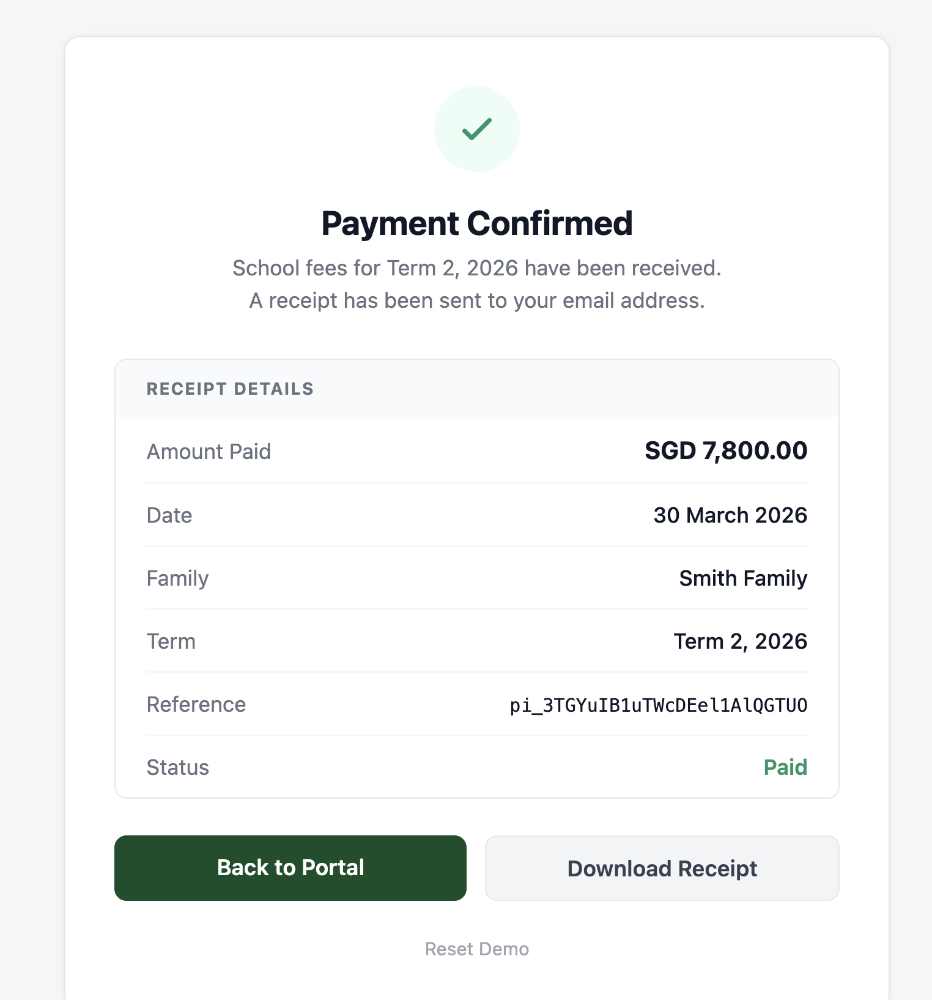
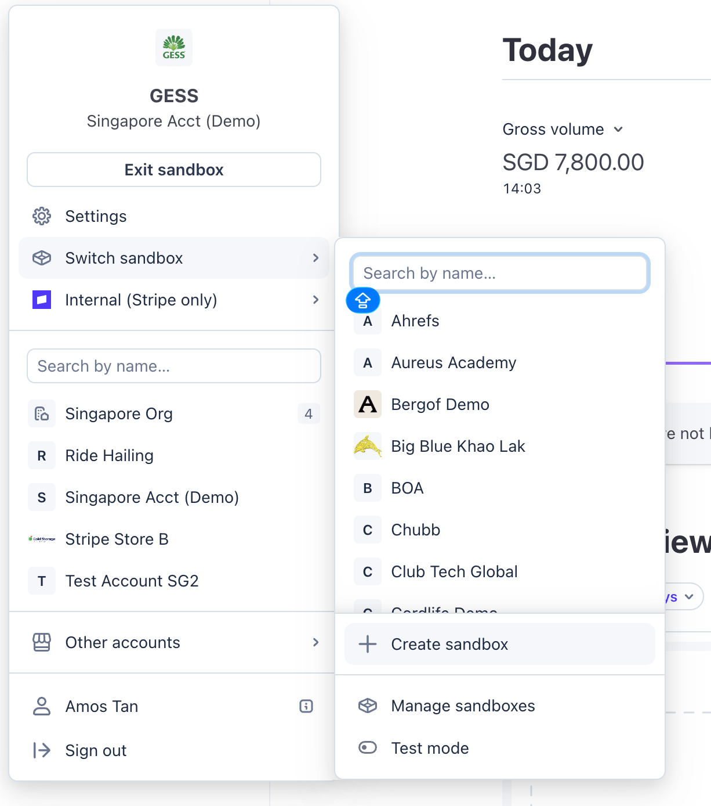
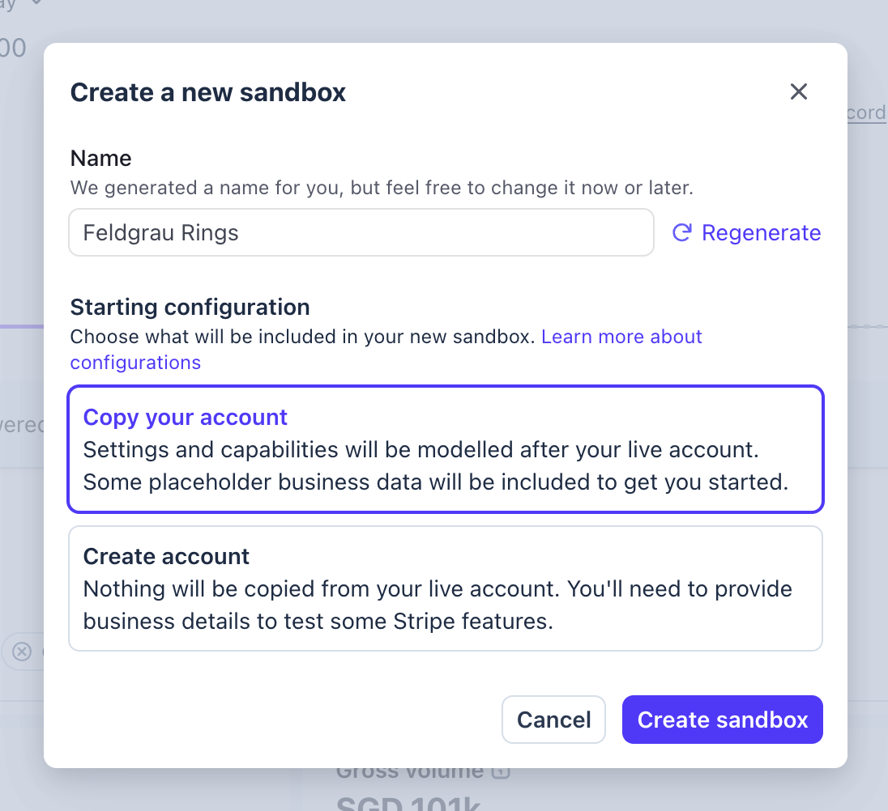

# GESS Parents Portal — Demo

A school fee payment portal demo built with [Stripe Checkout](https://stripe.com/checkout). Parents log in, review outstanding fees for the term, and pay via card or PayNow — all powered by Stripe.



---

## Demo flow

| Step | URL | What it shows |
|------|-----|---------------|
| 1 | `/` | Login page — click "Continue as Parent" |
| 2 | `/fees` | Fee summary — SGD 7,800 (2 × SGD 3,900) |
| 3 | Stripe | Hosted Checkout — card, PayNow, Link |
| 4 | `/success` | Payment confirmation with reference number |





---

## Setup

### 1. Create a Stripe Sandbox

This demo runs against a [Stripe Sandbox](https://docs.stripe.com/sandboxes) — an isolated test environment with no real money involved.

1. Go to the [Stripe Dashboard](https://dashboard.stripe.com) and sign in
2. Open the environment switcher in the top-left corner and select **Create sandbox**

   

3. Give it a name and choose a starting configuration — **Copy your account** is recommended so payment methods and settings are pre-configured

   

4. Inside the sandbox, go to **Developers → API keys**
5. Copy the **Secret key** (`sk_test_...`) and **Publishable key** (`pk_test_...`)

### 2. Enable PayNow (optional)

PayNow is a Singapore real-time payment method. To show it in Checkout:

1. In your sandbox, go to **Settings → Payment methods**
2. Search for **PayNow** and enable it

### 3. Install and configure

```bash
git clone https://github.com/amos-stripe/gess-demo.git
cd gess-demo
npm install
cp sample.env .env
```

Edit `.env` and paste in your sandbox API keys:

```
STRIPE_SECRET_KEY=sk_test_...
STRIPE_PUBLISHABLE_KEY=pk_test_...
```

### 4. Run

```bash
npm run dev
```

Open [http://localhost:3000](http://localhost:3000)

---

## Test payments

Use Stripe's [test card numbers](https://docs.stripe.com/testing#cards):

| Card | Number | Notes |
|------|--------|-------|
| Visa (success) | `4242 4242 4242 4242` | Any future expiry, any CVC |
| Card declined | `4000 0000 0000 0002` | Generic decline |

For **PayNow**: select PayNow in Checkout, then click **Complete payment** in the test mode banner — Stripe simulates the QR scan automatically.

See: [https://docs.stripe.com/payments/paynow](https://docs.stripe.com/payments/paynow)

---

## Demo tips

- **Switch families** — Use the "Demo: Switch Family" dropdown on the fees page to switch between the Smith family (2 students) and the Rosen family (2 students)
- **Reset** — Click **Reset Demo** in the top nav (or go to `/reset`) to clear the session and return to the login screen
- **Ctrl+H — highlight mode** — During a live demo, press Ctrl+H to toggle a blue highlight border around the Stripe-powered elements (the Pay button and Stripe badge). Press again to turn it off. Useful for drawing attention to where Stripe sits in the UI.

---

## Project structure

```
app.js                      → Express server
controllers/index.js        → Routes: /, /fees, /create-checkout, /success, /reset
views/
  pages/
    login.hbs               → Login page
    fees.hbs                → Fee summary + Pay button
    success.hbs             → Payment confirmation
    error.hbs               → Error handler
  partials/
    base.hbs                → GESS-branded portal layout with nav
    head.hbs                → CSS/JS includes
public/
  css/app.css               → GESS brand styles
  img/                      → Logo and assets
sample.env                  → Environment variable template
```
